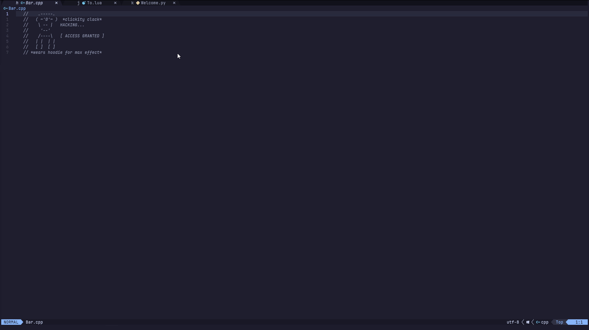

<h1 align="center">
  Barpoon
</h1>

<p align="center">
  <b>Use Harpoon to manage your bufferline</b>
</p>


Barpoon allows you to use Harpoon to control bufferline plugins [bufferline.nvim](https://github.com/akinsho/bufferline.nvim) or [barbar.nvim](https://github.com/romgrk/barbar.nvim).
This means your tabs and tab order are managed by your Harpoon list, 
and you can also add, remove, reorder and navigate your Harpoon list with your mouse using the bufferline.




#### Table of contents

- [Motivation](#motivation)
- [About](#about)
- [Installation](#installation)
- [Configuration](#configuration)
- [Usage](#usage)

## Motivation

The typical tab bar behavior works well for the mouse, but there are already more efficient ways to navigate a project using the keyboard in Neovim. 
Since we use the keyboard the majority of the time in Neovim, the tab bar can quickly become something you choose to ignore or disable, as it just builds up clutter with random files you briefly opened.

### What would be a better way to use a bufferline in Neovim?

1. Only keep tabs on the bufferline if you choose to pin them or if they are the visible buffer.
    - Fuzzy finders like [Telescope](https://github.com/nvim-telescope/telescope.nvim) or [fzf-lua](https://github.com/ibhagwan/fzf-lua) already provide quick ways to open those less frequently accessed files.
2. Provide a quick way to reorder, add, remove, and navigate tabs with the keyboard.
3. Project-specific session management.

This sounds very similar to how you would use [Harpoon](https://github.com/ThePrimeagen/harpoon/tree/harpoon2), so why not combine harpoon with a bufferline?

## About 

Barpoon combines the bufferline from plugins [bufferline.nvim](https://github.com/akinsho/bufferline.nvim) or [barbar.nvim](https://github.com/romgrk/barbar.nvim),
with [Harpoon](https://github.com/ThePrimeagen/harpoon/tree/harpoon2)'s workflow, improving tab management, and bridging the gap between keyboard and mouse navigation.
It acts as a graphical extension for Harpoon, allowing you to modify and navigate your Harpoon list via the UI using your mouse. 

Barpoon also supports the API methods from `bufferline.nvim` and `barbar.nvim`, so you may still use their methods for sorting and closing tabs and it will update your Harpoon list accordingly.


## Installation
In order to use Barpoon you must first install either [bufferline.nvim](https://github.com/akinsho/bufferline.nvim) or [barbar.nvim](https://github.com/romgrk/barbar.nvim)

### Requirements:
- [Harpoon](https://github.com/ThePrimeagen/harpoon/tree/harpoon2)

#### Supported bufferline plugins (Only use one)
  - [Barbar](https://github.com/romgrk/barbar.nvim)
  - [bufferline.nvim](https://github.com/akinsho/bufferline.nvim)


### [lazy.nvim](https://github.com/folke/lazy.nvim)

```lua 
-- Minimal installation
{
  'BourbonBidet/Barpoon',
  dependencies = {
    { 'ThePrimeagen/harpoon',
      branch = 'harpoon2',
    },

      -- NOTE: Pick one
    {'akinsho/bufferline.nvim'},
    -- {'romgrk/barbar.nvim'}, 
  },
  opts = {}, -- Config here
}
```

### [packer.nvim](https://github.com/wbthomason/packer.nvim)

```lua 
-- Minimal installation

-- NOTE: Pick one
use 'akinsho/bufferline.nvim'
-- use 'romgrk/barbar.nvim'
--

--Harpoon
use "nvim-lua/plenary.nvim" -- don't forget to add this one if you don't have it yet!
use {
    "ThePrimeagen/harpoon",
    branch = "harpoon2",
}

-- Barpoon
use {
  'BourbonBidet/Barpoon',
  requires = {
    {'akinsho/bufferline.nvim'}, -- Pick one
    -- {'romgrk/barbar.nvim'},

    {"ThePrimeagen/harpoon"},
  }
}

```

## Configuration

The majority of your config will be done in either your [Harpoon](https://github.com/ThePrimeagen/harpoon/tree/harpoon2) config or your bufferline config.

###   Default Barpoon config:

```lua
{
	plugin = nil, -- nil | 'bufferline' | 'barbar' : The bufferline plugin to use, will automatically detect installed plugin if set to nil

	open_tab_for_current_buffer = true, -- Open a tab while viewing a buffer that's not harpooned, and then close it when leaving the buffer

	show_pin_button_on_temp_tab = true, -- Replace the close button with a pin button on the temp tab, to add it to harpoon list

	pin_icon = "󰐃", -- Icon used for the pin button  NOTE: This button will harpoon the tab, not the built-in pin feature from bufferline or barbar

	-- list of labels to show per tab, useful for displaying Harpoon key maps to match each corresponding tab
	key_labels = nil, -- eg. {'h', 'j', 'k', 'l', ';', 'H', 'J', 'K', 'L'}. 


	--NOTE: config exlusive to bufferline.nvim
	bufferline = { -- Config options specific to bufferline.nvim

		hide_threshold = 0, -- Hide bufferline when less than or equal to hide_tab_amount. (Bufferline's default is 1, but for Barpoon it makes sense to show all Harpoon'd tabs)
				     -- NOTE: Must also set 'always_show_bufferline = false' and 'auto_toggle_bufferline = true' in your bufferline config
	},

	--NOTE: config exclusive to barbar.nvim
	barbar = {
		temp_tab_color = "#87d7af", -- Foregrond color for the temporary tab opened while viewing a file not in the harpoon list
	},
}
```

## Usage

- **Adding a tab:** Adding items to the Harpoon list or clicking the pin button adds them to the tab bar.

- **Managing tabs:** Use the Harpoon quick menu or drag tabs using the mouse to reorder tabs.

- **Removing tabs:** Use the Harpoon quick menu or click the close button to remove a tab.

- **Temporary tabs:** By default, a tab opens for the current file even if it's not pinned (configurable)

### User Commands

- `BaroonRestoreTab`: Reopens last closed tab and adds it back to harpoon list (does not apply to temporary tabs)

- `BarpoonHide`: Hides the bufferline

- `BarpoonShow`: Shows the bufferline

